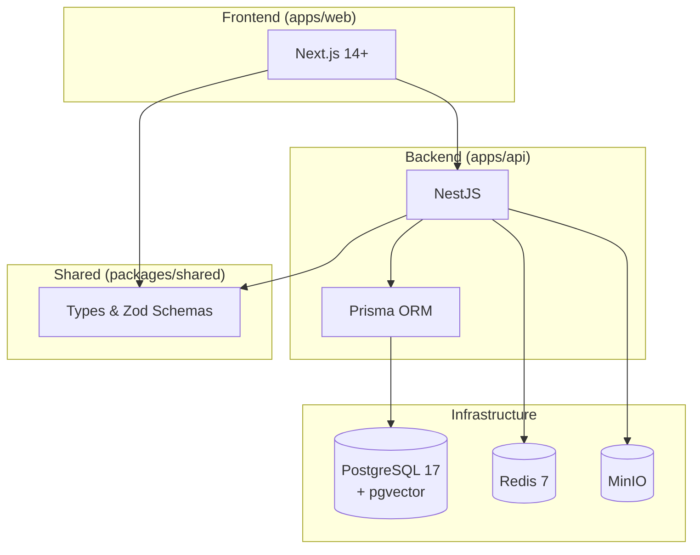

<div align="center">

# ktb.clubmanager

**Minimal effort club administration - less work than a spreadsheet**

[](https://github.com/ktb-clubmanager/ktb.clubmanager/actions/workflows/ci.yml)
[](https://www.gnu.org/licenses/agpl-3.0)
[](https://www.typescriptlang.org/)
[](http://makeapullrequest.com)

</div>

## What is this?

ktb.clubmanager is open-source club management software built for German *Vereine*. It combines member management with proper double-entry accounting using the SKR42 chart of accounts.

**Why does this exist?** Most club software either lacks real accounting or costs hundreds per year. ktb.clubmanager is free, web-based, and handles the accounting complexity that volunteer treasurers need.

**Key differentiators:**
- SKR42 chart of accounts (German nonprofit standard)
- SEPA direct debit generation (pain.008 XML)
- German bank CSV import (Sparkasse, VR, DKB, etc.)

## Key Features

- **Member management** - Track members, households, and membership history
- **Fee tracking** - Flexible fee structures, payment status, reminders
- **Double-entry bookkeeping** - SKR42 compliant, proper journal entries
- **SEPA direct debit** - Generate pain.008 files for bank submission
- **Bank import** - Import transactions from German bank CSV exports
- **Multi-tenant** - Manage multiple clubs from one installation

## Quick Start

The fastest way to get started uses VS Code DevContainers:

1. **Clone the repository**
   ```bash
   git clone https://github.com/ktb-clubmanager/ktb.clubmanager.git
   cd ktb.clubmanager
   ```

2. **Open in VS Code** and click "Reopen in Container" when prompted

3. **Start development**
   ```bash
   pnpm dev
   ```

The web app is available at `http://localhost:3000`.

## Development Setup

If you prefer not to use DevContainers, set up manually:

### Prerequisites

- Node.js 20+
- pnpm 10+
- Docker (for PostgreSQL, Redis, MinIO)

### Installation

```bash
git clone https://github.com/ktb-clubmanager/ktb.clubmanager.git
cd ktb.clubmanager
pnpm install
docker compose up -d
pnpm dev
```

### Common Commands

| Command | Description |
|---------|-------------|
| `pnpm dev` | Start development servers |
| `pnpm test` | Run all tests |
| `pnpm lint` | Check code quality |
| `pnpm typecheck` | Verify TypeScript types |
| `pnpm prepare-commit` | Run all checks before committing |

## Local Customizations

You can customize the DevContainer without affecting committed files. Edit `.devcontainer/docker-compose.local.yml` (auto-created, gitignored) to add personal volume mounts or environment variables.

See [.devcontainer/README.md](.devcontainer/README.md) for details.

## Architecture



The project is a **pnpm monorepo** with two applications (`web` and `api`) sharing types and validation schemas through a common package.

## Tech Stack

| Component | Technology | Why |
|-----------|------------|-----|
| Frontend | Next.js 14+, TypeScript, Tailwind, shadcn/ui | Modern React with full-stack TypeScript |
| Backend | NestJS, TypeScript, Prisma | Type safety for financial data |
| Database | PostgreSQL 17 + pgvector | ACID for accounting, vectors for AI semantic search |
| Storage | MinIO (S3-compatible) | Document uploads, receipt images, profile photos |
| Cache | Redis 7 | Session storage, background jobs |
| Auth | NextAuth.js + OIDC | Passwordless OAuth login |

## Roadmap

The project is currently in **pre-MVP** stage, building foundational infrastructure.

See [.planning/ROADMAP.md](.planning/ROADMAP.md) for the full development roadmap.

## Contributing

We welcome contributions from developers of all experience levels. Whether you want to fix a bug, add a feature, or improve documentation, your help is appreciated.

- Read our [CONTRIBUTING.md](CONTRIBUTING.md) guide to get started
- First-time contributors: you'll sign a simple CLA when opening your first PR

## License

ktb.clubmanager is licensed under the [GNU Affero General Public License v3.0](https://www.gnu.org/licenses/agpl-3.0).

This means you can use, modify, and distribute the software freely. If you run a modified version as a network service, you must make your source code available to users.

See [LICENSE](LICENSE) for the full license text.
