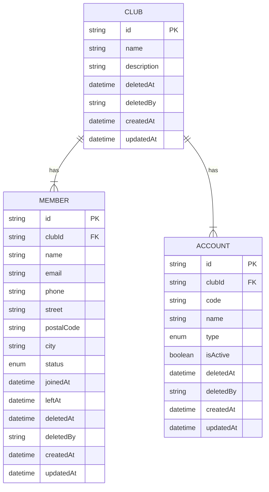
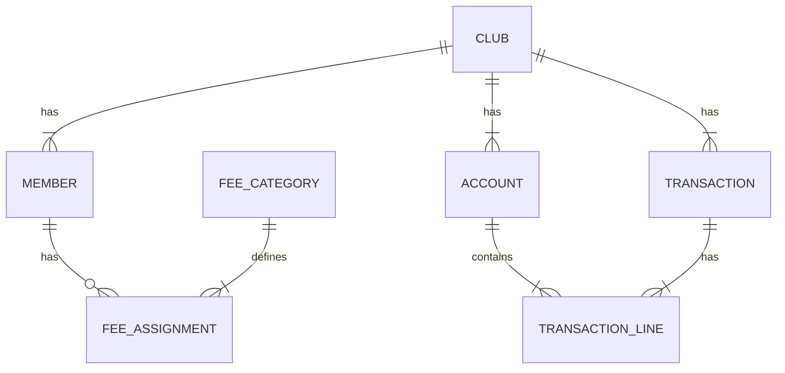

# Entity Relationship Diagram

This diagram shows the current database structure for ktb.clubmanager. The schema uses tenant isolation where each `Club` is the root entity and all other entities belong to exactly one club.

## Diagram

## Relationships

| From | To      | Cardinality | Description                                  |
| ---- | ------- | ----------- | -------------------------------------------- |
| Club | Member  | 1:N         | A club has many members                      |
| Club | Account | 1:N         | A club has many accounts (chart of accounts) |

## Relationship Notation

The diagram uses Mermaid erDiagram syntax:

- `||--|{` = exactly one to one or more (identifying relationship)
- `PK` = Primary Key
- `FK` = Foreign Key

## Entity Notes

### Club

The root tenant entity. All data isolation happens through the `clubId` foreign key on child entities.

### Member

Represents a person who is (or was) a member of a club. The `status` enum tracks membership lifecycle:

- ACTIVE, INACTIVE, PENDING, LEFT

### Account

Part of the chart of accounts (Kontenrahmen) based on SKR42 for German non-profits. The `type` enum categorizes accounts:

- ASSET, LIABILITY, INCOME, EXPENSE

## Future Extensions

This diagram shows the foundation schema. Future phases will add:

---

_Entity Relationship Diagram for ktb.clubmanager_
_See [README.md](./README.md) for schema documentation_
